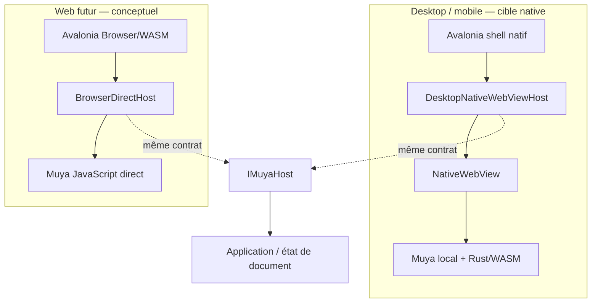

# Architecture multiplateforme Avalonia

> **Statut : architecture cible, pas livraison Web.**
>
> Cette note décrit les frontières à préparer pour Desktop, mobile et un futur
> client Web. Elle ne transforme pas le projet actuel en application Browser et
> ne doit pas être citée comme preuve que la cible Web existe.

## Décision d'architecture

Elephant doit garder un shell Avalonia natif et partager des contrats de domaine
entre les plateformes. Muya reste l'unique surface Web tolérée dans le client
Desktop/mobile : elle est chargée localement dans un `NativeWebView`. Le reste
de l'interface, la navigation, le vault, les paramètres et les services de
plateforme restent natifs.

La cible Web future ne doit pas embarquer un `NativeWebView` dans Avalonia : la
documentation Avalonia indique que `NativeWebView` n'est pas disponible sur la
cible Browser, alors qu'une application Avalonia Browser est publiée comme un
site statique WebAssembly. Le futur Web devra donc charger Muya directement
comme module JavaScript et conserver le même contrat d'éditeur.



### Ce qui est livré aujourd'hui

- le shell Avalonia et une première tranche de vault/Markdown local ;
- `MuyaEditorHost` et le protocole JSON Muya côté C# ;
- un bundle Muya local utilisant le code Muya existant et Rust/WASM ;
- une validation du bundle Muya dans un navigateur de test, ainsi que des tests
  de contrat C#.

### Ce qui n'est pas livré

- `IMuyaHost` comme abstraction multiplateforme publique ;
- `DesktopNativeWebViewHost` et `BrowserDirectHost` comme classes de production
  finales ;
- une cible Avalonia `net8.0-browser` ou `net9.0-browser` ;
- un serveur de vault, `ServerFileStore` ou `ServerSync` ;
- la parité fonctionnelle Desktop/mobile/Web ;
- la preuve d'un parcours complet dans une vraie fenêtre Avalonia avec le
  `NativeWebView` de chaque plateforme.

Les noms `IMuyaHost`, `DesktopNativeWebViewHost` et `BrowserDirectHost` sont donc
des noms de frontière d'architecture. Ils ne doivent pas être présentés comme
des implémentations déjà disponibles.

## Contrat Muya : `IMuyaHost`

Le contrat conceptuel doit être indépendant du transport. Il porte sur le
document et les intentions utilisateur, pas sur un contrôle Avalonia ni sur une
API DOM.

```text
IMuyaHost
  OpenDocument(documentId, path, markdown, title)
  SetMarkdown(markdown)
  GetMarkdown()
  RequestFocus()
  SetTheme(theme)
  Undo() / Redo()

  DocumentOpened(document)
  ContentChanged(documentId, markdown, revision)
  SaveRequested(documentId, markdown)
  Error(documentId, code, message)
```

Les noms exacts et les signatures restent à stabiliser dans une future
interface. Le protocole JSON existant est la référence de transport actuelle :
les messages doivent être versionnés, bornés, corrélés à un `documentId` et
refuser les commandes inconnues.

### Adaptateurs

| Adaptateur | Responsabilité | Statut |
| --- | --- | --- |
| `DesktopNativeWebViewHost` | Traduire `IMuyaHost` vers `Source`, `InvokeScript`, `WebMessageReceived` et `NavigationCompleted` d'un `NativeWebView`. | Conceptuel ; le projet possède une tranche native `MuyaEditorHost`/`AvaloniaMuyaWebView`, mais la verticale réelle Avalonia reste à prouver par plateforme. |
| `BrowserDirectHost` | Traduire `IMuyaHost` vers les fonctions JS Muya directes et l'interop `[JSImport]`/`[JSExport]` d'Avalonia Browser. | Conceptuel, non livré. |
| `MuyaEditorHost` | Orchestrer le document et le protocole côté shell actuel. | Livré dans la tranche native actuelle, sans prétendre être le contrat Web final. |

### Autorité des états

Pour éviter deux éditeurs concurrents, les responsabilités doivent rester
séparées :

| État | Autorité |
| --- | --- |
| DOM, caret, sélection, IME et interaction clavier | Muya dans la surface d'édition |
| Parse/transformations Rust exposées par Muya | cœur Muya/Rust, selon les opérations supportées |
| chemin de fichier, vault, sauvegarde et lifecycle | shell Avalonia et `IFileStore` |
| synchronisation, conflits et reprise | `ISyncService` |

Le validateur Rust utilisé par le bundle actuel reconstruit un snapshot Markdown
éphémère pour vérifier le parse et la sérialisation ; il ne doit pas devenir un
second writer ni un second éditeur qui concurrence le DOM Muya ou la sauvegarde.
Une future implémentation devra expliciter cette règle dans ses tests.

## Stockage : `IFileStore`

Le shell et les ViewModels ne doivent pas dépendre directement de
`File.ReadAllText`, `File.WriteAllText` ou d'un chemin OS. La frontière cible est
un `IFileStore` conceptuel, avec des identifiants de document et des résultats
qui conservent les erreurs et la version observée.

```text
IFileStore
  ListEntries(scope)
  ReadDocument(documentId)
  WriteDocument(documentId, markdown, expectedVersion)
  CreateEntry(parentId, kind, name)
  MoveEntry(documentId, destination)
  DeleteEntry(documentId)
  ReadAsset(assetId)
```

| Implémentation cible | Backend | Comportement |
| --- | --- | --- |
| `LocalFileStore` | fichiers locaux du vault Desktop/mobile | chemins normalisés, confinement au vault, écritures atomiques, version locale et erreurs visibles |
| `ServerFileStore` | API HTTPS/WebSocket d'un futur serveur Elephant | identités opaques, authentification, ETag/version, permissions et conflits retournés au client |

La `VaultRepository` actuellement présente est une implémentation locale de la
tranche Avalonia ; elle n'est pas encore le contrat `IFileStore` partagé par
toutes les plateformes. `ServerFileStore` est **non livré**.

### Sauvegarde et synchronisation

La sauvegarde Muya suit le flux suivant, quelle que soit la plateforme :

```text
Muya ContentChanged
      ↓
état de document dirty
      ↓ Ctrl+S / autosave
IFileStore.WriteDocument
      ↓
ISyncService.Enqueue / Commit local
```

`ISyncService` est également conceptuel :

```text
ISyncService
  Observe(documentId)
  Enqueue(localChange)
  Push()
  Pull()
  ResolveConflict(conflict, resolution)
  StateChanged(state)
```

- Desktop/mobile peuvent conserver une stratégie local-first et un transport
  natif tel qu'Iroh lorsque celui-ci sera adapté.
- Web devra utiliser un `ServerSync` ou un transport équivalent, car un client
  Browser ne peut pas supposer la présence d'un processus natif local.
- Aucun de ces transports n'est actuellement livré dans cette arborescence.

## Services de plateforme

Les fonctionnalités OS doivent passer par des contrats étroits. Cela permet au
shell partagé de rester testable sans fabriquer un faux succès.

### Clipboard : `IClipboard`

```text
IClipboard
  ReadText()
  WriteText(text)
  ReadHtml()        (optionnel, capability vérifiée)
  WriteHtml(html)   (optionnel, capability vérifiée)
```

`NativeClipboard` utilisera les API Avalonia du Desktop/mobile. `BrowserClipboard`
utilisera l'API Clipboard du navigateur sous permission et, si nécessaire,
dans le cadre d'une action utilisateur. L'absence de permission doit produire
une erreur visible ; elle ne doit pas être convertie en chaîne vide.

Le clipboard interne de Muya reste sous la responsabilité de Muya pendant une
édition. Le contrat shell sert aux commandes globales et aux intégrations hors
éditeur.

### Ouverture externe : `IExternalOpener`

```text
IExternalOpener
  OpenUrl(uri)
  OpenFile(pathOrAssetId)
```

- `NativeExternalOpener` pourra déléguer à l'association OS, avec validation de
  schéma et de chemin.
- `BrowserExternalOpener` devra utiliser une URL autorisée, un téléchargement
  ou `window.open` soumis aux règles du navigateur. Il ne peut pas promettre
  l'ouverture d'une application locale comme VLC.
- Ces adaptateurs ne sont pas livrés par la tranche Avalonia actuelle.

Les addons, les processus locaux, Codex CLI, `llama-server`, les watchers de
fichiers et l'exécution de commandes nécessitent des contrats similaires et ne
doivent pas être exposés implicitement au futur Web.

## Limites Avalonia Browser/WASM

Avalonia Browser produit des fichiers statiques côté client et permet une
interopérabilité JavaScript via `[JSImport]`/`[JSExport]`. Cela rend une cible
Web possible en théorie, mais cela ne signifie pas qu'elle est configurée dans
ce projet.

| Capacité | Desktop/mobile natif | Browser/WASM futur |
| --- | --- | --- |
| Shell Avalonia | Cible de la migration actuelle | Projet Browser distinct à créer |
| Muya | `NativeWebView` local | Muya JS direct, sans `NativeWebView` |
| Fichiers | vault local | `ServerFileStore` ou API choisie |
| Sync | transport natif/local-first possible | serveur/WebSocket ou autre transport Web |
| Processus OS | possible via adaptateur explicite | absent du sandbox navigateur |
| Clipboard | API native | permission et geste utilisateur requis |
| Ouverture d'application | association OS | URL/téléchargement, capacité réduite |
| Addons privilégiés | hôte natif contrôlé | sandbox et permissions explicites |
| Offline complet | possible avec fichiers locaux | à concevoir ; cache local ne remplace pas le vault serveur |

La publication Native AOT documentée dans [publishing.md](publishing.md) ne
produit pas une application WebAssembly. Il n'existe pas encore de projet
Browser, de `wwwroot` Web Elephant, de serveur de vault ni de test E2E Browser
Avalonia dans cette arborescence.

## Conditions avant d'annoncer le Web

Le Web ne pourra être marqué comme livré qu'après, au minimum :

1. un projet Avalonia Browser compilé avec le workload WASM ;
2. `BrowserDirectHost` branché au même contrat de document que l'hôte natif ;
3. un `ServerFileStore` et une authentification/autorisation documentées ;
4. sauvegarde, reload, conflits et reprise testés contre un serveur réel ;
5. clipboard, téléchargement/ouverture externe et permissions testés dans un
   navigateur réel ;
6. un parcours E2E utilisateur : ouvrir → modifier → sauvegarder → recharger,
   sans mutation DOM injectée ni mock de l'éditeur ;
7. un rapport séparant les preuves `PROVEN`, `PARTIALLY PROVEN`, `NOT PROVEN`
   et les limites restantes.

## Références

- [Avalonia NativeWebView](https://docs.avaloniaui.net/controls/web/nativewebview) :
  API et matrice de plateformes ; Browser n'y fournit pas `NativeWebView`.
- [Avalonia WebAssembly deployment](https://docs.avaloniaui.net/docs/deployment/webassembly) :
  publication statique et limites de déploiement.
- [Avalonia WebAssembly interop](https://docs.avaloniaui.net/docs/platform-specific-guides/webassembly) :
  interop JavaScript `[JSImport]`/`[JSExport]`.
- [Publishing Avalonia Native AOT](publishing.md) : publication native actuelle,
  distincte d'une publication Browser/WASM.
