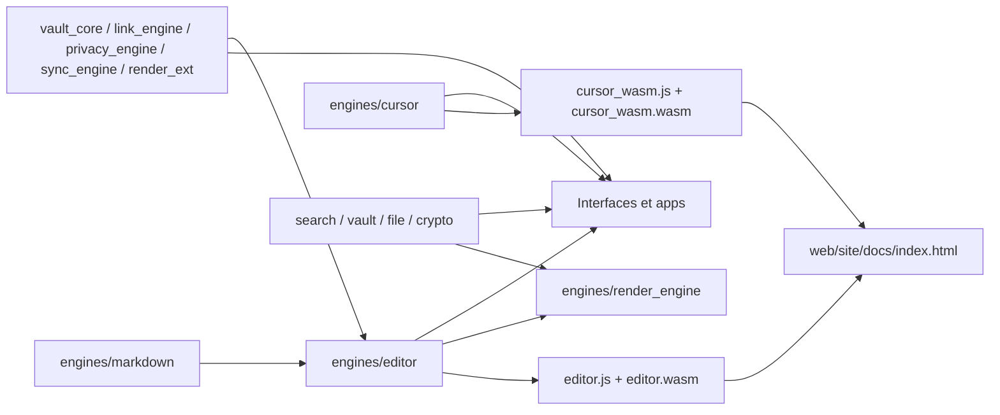
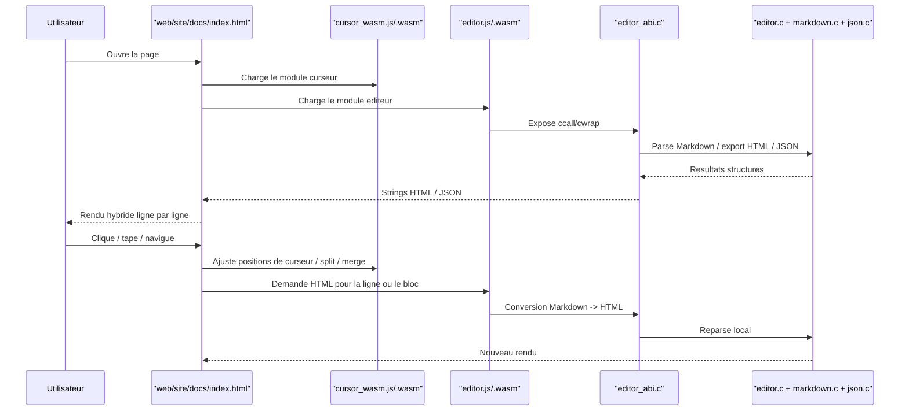
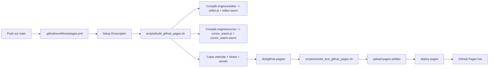

# Architecture ElephantNote

Ce document donne une vue rapide de la structure du depot et des flux principaux.

## Vue d'ensemble du depot

```mermaid
flowchart TD
    root["ElephantNote"]

    root --> engines["engines/"]
    root --> web["web/site/"]
    root --> scripts["scripts/"]
    root --> workflows[".github/workflows/"]
    root --> dist["dist/github-pages/"]
    root --> docs["docs/"]
    root --> flutter["flutter/"]
    root --> macos["Shells macOS historiques"]

    engines --> markdown["markdown<br/>Parsing Markdown + JSON"]
    engines --> editor["editor<br/>Document + ABI + HTML/JSON + WASM"]
    engines --> cursor["cursor<br/>Gestion curseur / edition hybride"]
    engines --> render["render_engine<br/>Rendu natif"]
    engines --> support["file/search/vault/crypto<br/>Sous-librairies C de support"]
    engines --> platform["vault_core / link_engine / privacy_engine<br/>sync_engine / render_ext"]
    engines --> ui["ui_framework / search_interface / hybrid_editor<br/>Couches UI / integration"]

    web --> docsApp["docs/index.html<br/>Demo web principale"]
    web --> docsAssets["Assets publishes pour GitHub Pages"]

    scripts --> buildPages["build_github_pages.sh"]
    scripts --> smoke["smoke_test_github_pages.sh"]
    scripts --> validation["run-full-validation.sh / validate-release.sh"]

    workflows --> pages["pages.yml<br/>Build + publish Pages"]
    dist --> pagesArtifact["Artefact final deploye"]

    macos --> legacyApps["MarkdownEditorApp / app bundles / versions historiques"]
```

## Dependances logiques du coeur C

## Flux d'execution de l'editeur web

## Pipeline GitHub Pages

## Lecture rapide

- `engines/markdown` fait le parsing et la transformation structurelle du Markdown.
- `engines/editor` est le coeur le plus important pour la demo web: il expose l'ABI C, la conversion HTML et la cible WASM.
- `engines/cursor` sert la logique d'edition hybride et de positionnement.
- `engines/vault_core`, `engines/link_engine`, `engines/privacy_engine`, `engines/sync_engine` et `engines/render_ext` sont la fondation en cours pour le futur mode vault local, les liens de notes, la confidentialite, la sync reseau et les extensions Markdown enrichies.
- `web/site/docs/index.html` est l'interface de reference actuellement exposee sur GitHub Pages.
- `scripts/build_github_pages.sh` et `scripts/smoke_test_github_pages.sh` sont le chemin canonique pour valider la publication.
- Les shells macOS et certains repertoires d'apps sont encore presents, mais ne sont pas le chemin principal de la demo web actuelle.
